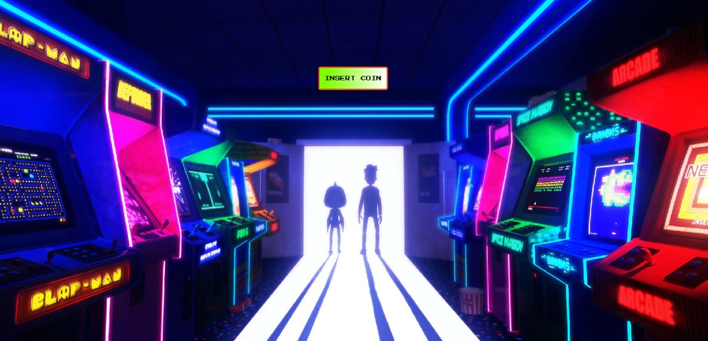
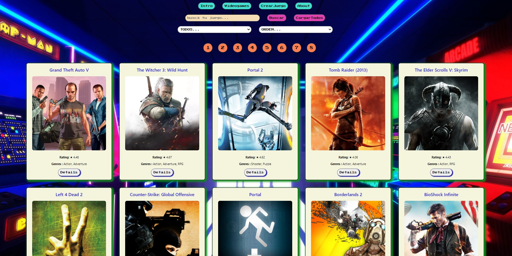
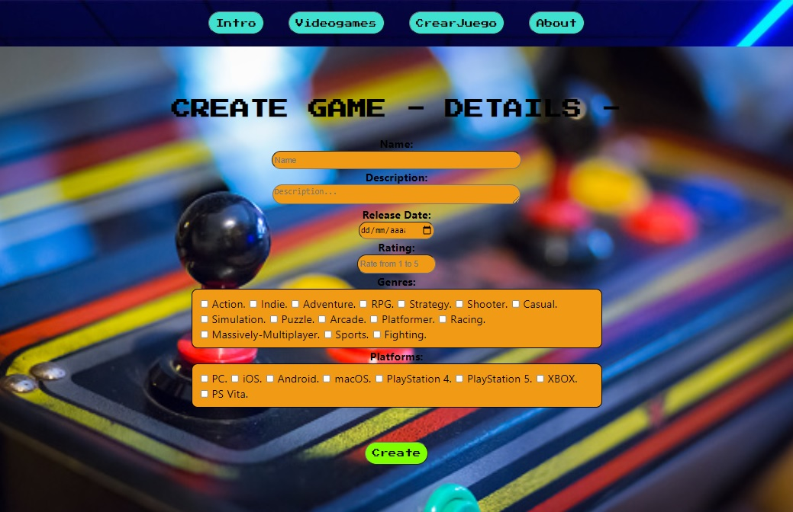
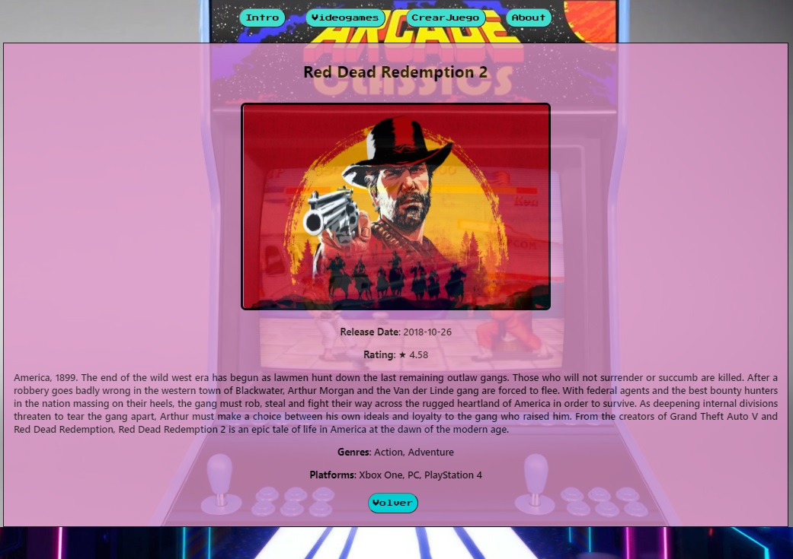

# Videogames App

  

Topic: Retro Design App dedicated to find Information from more than 500.000 games data base API.
       Where users can filter, order, learn and even create their own games register.

#### Technologies:

- [ ] React
- [ ] Redux
- [ ] NodeJs
- [ ] Express
- [ ] Sequelize
- [ ] Postgres
- [ ] JEST (Unit Test)

## LANDING:

  

## HOME:

  

## CREATE:

  

## DETAILS:

  

